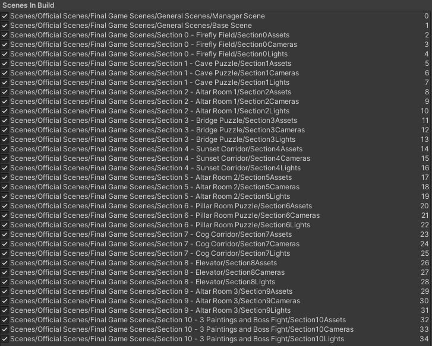
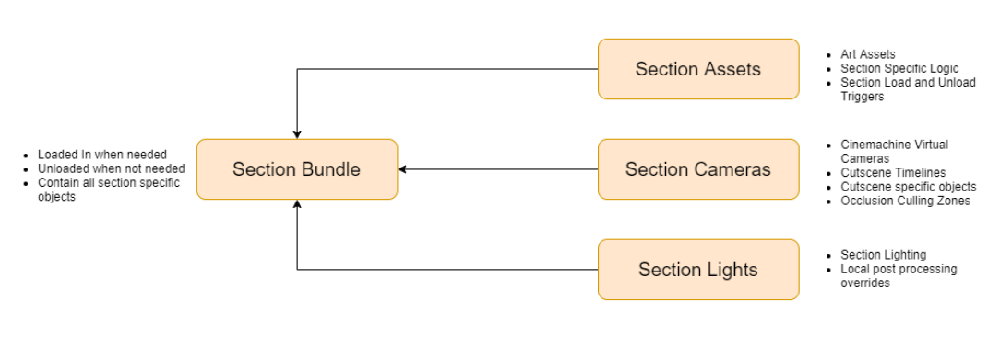
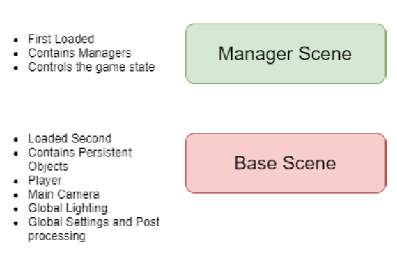

# Ourea

## Project Description
Ourea was my final year project for my Bachelor’s Degree in Games Design and was created by a 5 man team over 9 months. I had the role of lead tech, meaning that I was in charge of the technical aspects of the game as well as source control. Additionally, I also was in charge of Audio and Lighting. The game received first-class honours as well as two awards at Ireland’s game festival “Game Fleadh”. Ourea won “Best Game Built using a Game Engine” as well as “Best in Social Impact”. After our college course had ended, the team spent an additional two months to polish the game further and release it on Steam (https://store.steampowered.com/app/1250030/Ourea/) and Itch.io (https://rewritegames.itch.io/ourea). Overall, even though the game is far from perfect, this project was a tremendous learning experience. It required everyone involved to improve and learn quickly and work as a team over a large amount of time. A short summary of the project can be found below:

### High-Level Project Overview
- Elevator Pitch: Ourea is a cinematic narrative game where you discover the harrowing past of a long-forgotten world. Overcome environmental puzzles as you ascend an ancient and mysterious mountain. 
- Player motivation: Discover the world’s ancient past and solve puzzles that help you ascend the mysterious mountain. 
- Genre: Narrative game with an emphasis on cinematic storytelling with puzzle elements. 
- Target Audience: People that enjoy narrative-driven games with puzzle elements such as What Remains of Edith Finch, Journey and Inside.
- Unique Selling Point: Cinematic storytelling in a narrative puzzle game. 
- Summary Overview: In a quiet, abandoned world we meet our protagonist Glyf whose journey of discovery leads him toward the summit of a nearby looming mountain. Through a series of trials and tribulations, Glyf overcomes environmental challenges while escaping a mysterious force in search of his purpose and past.

## My Work
### Gameplay
I implemented all gameplay within Ourea. Below I outline some specifics that I created over the 9 months of development.

#### Player
I implemented all player mechanics. This included movement, interactions, animation implementation as well as procedural animation, cross-scene cutscene controls and all others.

#### Puzzle Implementation
I implemented the three puzzles and the final battle mechanics. This included creating the growth rune, the squish rune, the seesaw mechanic, the broken growth rune, the boulder and the planks for the bridge puzzle.

### Scene Loading
Ourea is playable from start to finish, without a loading screen once the game started. This was due to the game long-shot approach, which meant that the camera would not cut throughout the entire game. This meant that Ourea required an additive scene loading strategy. The game was split into 11 sections made up of a total of 35 scenes. These were loaded in, mid gameplay, whenever the player progressed to them and unloaded when the player was unable to backtrack to them.

The final version of the level loading worked in the following ways. A scene bundle asset that contains references to its Assets, Camera and Lights scene gets used to async load those scenes. Then the three scenes are merged to allow for easier unloading. The lag spike caused by loading in new sections was optimised by splitting the load into three async operations as well as creating a Gradual Loader that instantiated monobehaviours frame by frame. This was done using the abstract class Gradual Loader that allowed for all intensive monobehaviours to be easily adopted into the gradual loading process.

The objects, scripts and managers that were required throughout the entire game, were loaded in first and never unloaded. These scenes were called the manager scene and the base scene. The manager scene contained objects that were required for loading of scenes, saving the game, a wrapper to get references between scenes, Steamworks implementation and editor functionality to allow for easy playtesting. The base scene where game objects that were in the game all the way through. This included objects like the player, the camera, directional lighting and more.

### Menus
I created menus for the game that worked for both controller and keyboard and mouse. The menus included:
- Settings: This allowed you to changes various game and audio settings which would save across different sessions.
- Controls: This was a small tab that displayed how to control the game, with both controller and keyboard.
- Gallery: This tab showcased all of the discovered intractable cave paintings that player had found. It also allowed the player to rewatch them.
- Level Select: This tab gets unlocked, once the player finishes the game. It allows the player to replay the game from four different points in the story.

.PNG)

### Game Saving
I created a save system that loads the player in where they last left off. This was done through a binary encoder for security. This is integrated into the level select in the UI. I also added saving of settings and audio levels through player prefs.

### Optimisation
As the game got closer to release, I spent a large amount of time optimising the game. This included the use of occlusion culling, lighting optimisations and static batching and GPU instancing. The Gradual Loader was also introduced late in development, which helped tremendously with loading frame rate drops.

.PNG)

### Steam Integration
I integrated steam achievements and other steam functionality using the C# Steamworks wrapper Steamworks.NET (http://steamworks.github.io/).

### Audio
 I created all sounds (excluding music) in the game. The process was sourcing multiple sounds on FreeSounds.org, editing them heavily and combining multiple sounds in Adobe Audition and Audacity. This also included creating audio for the various cutscene throughout the game, SFX and ambience.

### Lighting
I created the lighting for all areas of the game. Each section was reworked multiple times throughout the phases of the project. Lighting also included creating local density volumes to accentuate volumetric rays.

### Marketing
I created and edited all trailers for Ourea. This was done using Sony Vegas. The final release trailer can be found below and all older trailers can be found on the youtube channel: https://www.youtube.com/channel/UC3uP5-oRYvJbEzYmkBJZqDQ.

## Documentation
Throughout the development process, the team and I created various documents for the game. These can be found in the Documents folder of this repo.

## Usage Help
The game is available for purchase on Steam (https://store.steampowered.com/app/1250030/Ourea/), however, feel free to email me and I can send you a link to a full build for free.
